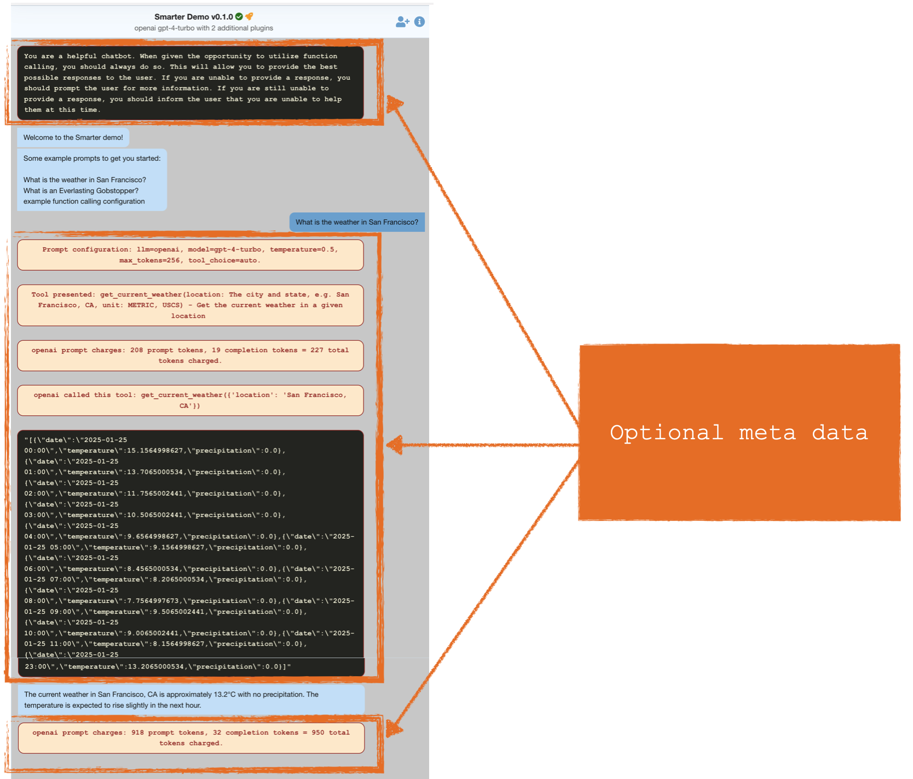

[](https://github.com/smarter-sh/smarter-chat/)
[](https://github.com/smarter-sh/smarter-chat/)
<a href="https://smarter.sh">

</a>

# SmarterChat React.js component

This project contains the source code for the interactive chatbot found in the Smarter web console [developer sandbox](https://platform.smarter.sh/chatbots/example/). It integrates natively with Smarter Saas and on-premise installations. You can optionally enable the meta data output behavior found in the Smarter sandbox.

This project is also suitable for all front-end cross-platform projects. For example, use this code base to create a react.js run-time for use inside of Wordpress plugins, salesforce.com apps, .net components and Sharepoint add-ins.

This app interacts with two endpoints from the [smarter.sh/v1](https://platform.smarter.sh/docs/api/) api:

- GET `https://<name>.<account_number>.example.com/config/`: retrieves a json dict, structured in 4 major sections, with all information required by the react app. Example - `https://smarter.4386-2072-3294.api.smarter.sh/config/`
- POST `https://<name>.<account_number>.example.com/chat/`: send a text completion prompt to the Smarter Api. Example - `https://smarter.4386-2072-3294.api.smarter.sh/chat/`

## Usage

```console
npm install @smarter/ui-chat
```

```jsx
import React from "react";
import ReactDOM from "react-dom/client";
import { SmarterChat } from "@smarter/ui-chat";

// Api url endpoint for your chatbot.
const apiUrl = "https://platform.smarter.sh/chatbots/example/config/";

// Optional: if your chatbot requires an api key.
const apiKey = "YOUR-32-CHARACTER-API-KEY";

// whether to include back end meta data in chat thread.
// set to true if your use case is instructional in nature
// (ie. you're teaching a generative AI course)
const toggleMetadata = false;

ReactDOM.createRoot(document.getElementById("root")).render(<SmarterChat apiUrl={apiUrl} apiKey={apiKey} toggleMetadata={toggleMetadata} />);
```



## Application Integration

Add the following to your web page.

```html
<!-- react.js app entry point.  -->
<div id="smarter-sh-v1-ui-chat-root" smarter-chatbot-api-url="https://smarter.3141-5926-5359.smarter.sh" smarter-toggle-metadata="false"></div>
<!--
    retrieves and injects the contents of https://cdn.platform.smarter.sh/ui-chat/index.html
    js/css artifacts of the react.js build into the DOM.
  -->
<script async="" src="https://cdn.platform.smarter.sh/ui-chat/app-loader.js"></script>
```

where:

- id: the unique html element id that the react app looks for during app initialization. see: dispatch().context in https://github.com/smarter-sh/smarter/blob/main/smarter/smarter/apps/chatapp/views.py
- smarter-chatbot-api-url: a Smarter chatbot api url: `https://<name>.<account_number>.example.com`
- smarter-toggle-metadata: true if additional chat meta data should appear in the chat thread

example ui-chat/index.html:

```html
<script type="module" crossorigin src="https://cdn.platform.smarter.sh/ui-chat/assets/main-BdQGq5eL.js"></script>
<link rel="stylesheet" crossorigin href="https://cdn.platform.smarter.sh/ui-chat/assets/main-BqQx6IPH.css" />
```

## smarter.sh Technical Reference

SmarterChat is created with [React](https://react.dev/) leveraging [@chatscope/chat-ui-kit-react](https://www.npmjs.com/package/@chatscope/chat-ui-kit-react)

### Backend integration

#### Config

A Json dict containing all configuration data for the chatbot. This is downloaded at run-time when the reactapp is initializing.
Example: [/chatbots/example/config/?session_key=YOUR-SESSION-KEY](http://localhost:8000/chatbots/example/config/)

See: [sample config](./data/sample-config.json)

#### Api

A REST Api for sending and receiving chat prompt requests. The url comes from the config dict (above): data.chatbot.url_chatbot.
example: `http://api.smarter.sh/v1/chatbots/smarter/example/`

example http request:

```json
{
    "method": "POST",
    "credentials": "include",
    "mode": "cors",
    "headers": {
        "Accept": "application/json",
        "Content-Type": "application/json",
        "X-CSRFToken": "q9WXqqIhYJMI3ZSBIOE18JMORBMqAHri",
        "Origin": "http://localhost:8000",
        "Cookie": "session_key=a07593ecfaecd24008ca4251096732663ac0213b8cc6bdcce4f4c043276ab0b5; debug=true;"
    },
    "body": "{\"session_key\":\"a07593ecfaecd24008ca4251096732663ac0213b8cc6bdcce4f4c043276ab0b5\",\"messages\":[{\"role\":\"system\",\"content\":\"You are a helpful chatbot."},{\"role\":\"assistant\",\"content\":\"Welcome to the Smarter demo!\"}]}"
}
```

example http response:

```json
{
  "data": {
    "isBase64Encoded": false,
    "statusCode": 200,
    "headers": {
      "Content-Type": "application/json"
    },
    "body": "{\"id\": \"chatcmpl-AoDpMvoAhf8iSJuEm6pMqkX62HK4G\", \"choices\": [{\"finish_reason\": \"stop\", \"index\": 0, \"logprobs\": null, \"message\": {\"content\": \"Hello! While I'm not your mom, I'm here to help you with any questions or tasks you have. What can I assist you with today?\", \"refusal\": null, \"role\": \"assistant\", \"audio\": null, \"function_call\": null, \"tool_calls\": null}}], \"created\": 1736532916, \"model\": \"gpt-4-turbo-2024-04-09\", \"object\": \"chat.completion\", \"service_tier\": \"default\", \"system_fingerprint\": \"fp_f17929ee92\", \"usage\": {\"completion_tokens\": 33, \"prompt_tokens\": 1122, \"total_tokens\": 1155, \"completion_tokens_details\": {\"accepted_prediction_tokens\": 0, \"audio_tokens\": 0, \"reasoning_tokens\": 0, \"rejected_prediction_tokens\": 0}, \"prompt_tokens_details\": {\"audio_tokens\": 0, \"cached_tokens\": 0}}, \"metadata\": {\"tool_calls\": null, \"model\": \"gpt-4-turbo\", \"temperature\": 0.5, \"max_tokens\": 256, \"input_text\": \"hi mom\"}}"
  },
  "api": "smarter.sh/v1",
  "thing": "Chatbot",
  "metadata": {
    "command": "chat"
  }
}
```

## Contributor Reference

### Getting Started

Use the Makefile that is included. Type `make` for a full menu of commands. It does several things that will save you lots of time, namely, it:

- sets up your Node environment for you
- initializes pre-commit, which you need to run prior to creating pull requests
- provides helpful automations for build-deploy to AWS Cloudfront

Setup your environment for first time use:

```console
make init
```

Run the dev server locally

```console
make run
```

Build the react.js project

```console
make build
```

Deploy the react.js project

```console
make release
```

### Architecture

- [Vite](https://vitejs.dev/)
- [React](https://react.dev/)
- [Chat UI Kit React](https://www.npmjs.com/package/@chatscope/chat-ui-kit-react)

### Vite Scripts for React

In the project directory, you can run:

#### `npm start`

Runs the app in the development mode.\
Open [http://localhost:3000](http://localhost:3000) to view it in your browser.

The page will reload when you make changes.\
You may also see any lint errors in the console.

#### `npm test`

Launches the test runner in the interactive watch mode.\
See the section about [running tests](https://facebook.github.io/create-react-app/docs/running-tests) for more information.

#### `npm run build`

Builds the app for production to the `build` folder.\
It correctly bundles React in production mode and optimizes the build for the best performance.

The build is minified and the filenames include the hashes.\
Your app is ready to be deployed!

See the section about [deployment](https://facebook.github.io/create-react-app/docs/deployment) for more information.

#### `npm run eject`

**Note: this is a one-way operation. Once you `eject`, you can't go back!**

If you aren't satisfied with the build tool and configuration choices, you can `eject` at any time. This command will remove the single build dependency from your project.

Instead, it will copy all the configuration files and the transitive dependencies (webpack, Babel, ESLint, etc) right into your project so you have full control over them. All of the commands except `eject` will still work, but they will point to the copied scripts so you can tweak them. At this point you're on your own.

You don't have to ever use `eject`. The curated feature set is suitable for small and middle deployments, and you shouldn't feel obligated to use this feature. However we understand that this tool wouldn't be useful if you couldn't customize it when you are ready for it.

## Contributing

We welcome contributions! There are a variety of ways for you to get involved, regardless of your background. In addition to Pull requests, this project would benefit from contributors focused on documentation and how-to video content creation, testing, community engagement, and stewards to help us to ensure that we comply with evolving standards for the ethical use of AI.

You can also contact [Lawrence McDaniel](https://lawrencemcdaniel.com/contact) directly.
