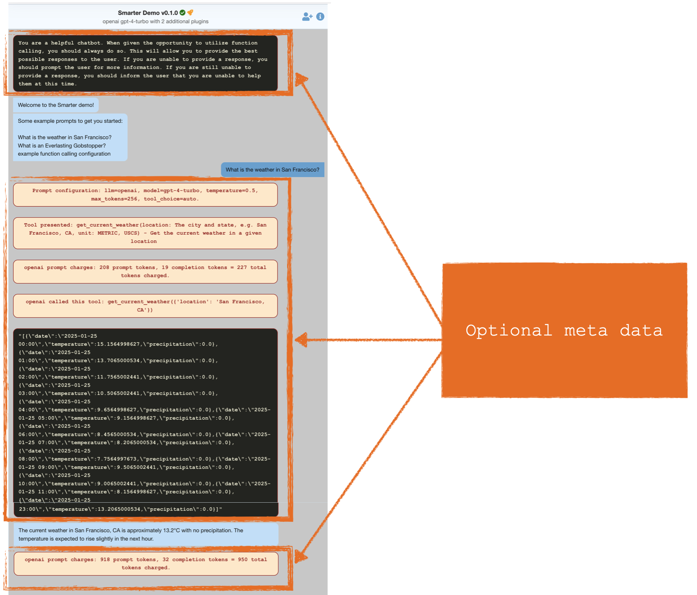

[](https://www.npmjs.com/package/@smarter.sh/ui-chat)
[](https://github.com/smarter-sh/smarter-chat/)
[](https://github.com/smarter-sh/smarter-chat/actions/workflows/test.yml)
[](https://codecov.io/gh/smarter-sh/smarter-chat)
<a href="https://smarter.sh">

</a>

# Smarter Chat

Smarter Chat is the React chat component of the [Smarter](https://smarter.sh) LLMClient prompt engineering
workbench. Beside the chat, its Console displays the LLMClient's configuration, and the chat session's api calls,
tool calls and plugin usage. A toggle shows and hides the backend's own messages in the chat thread, and a failed
prompt is displayed in the thread with the LLM provider's error message.

It is also published to npm as [@smarter.sh/ui-chat](https://www.npmjs.com/package/@smarter.sh/ui-chat), so that
any web page can use a Smarter LLMClient as its chat backend: a Wordpress or Squarespace site, a Salesforce portal,
a Shopify storefront, a Sharepoint add-in, or your own web application.



See the [Smarter Chat documentation](https://docs.smarter.sh/en/latest/smarter-framework/developer-reference/react-integration/smarter-chat.html).

## Usage

```console
npm install @smarter.sh/ui-chat
```

```tsx
import { createRoot } from "react-dom/client";
import { SmarterChat } from "@smarter.sh/ui-chat";
import "@smarter.sh/ui-chat/dist/ui-chat.css";

createRoot(document.getElementById("chat")!).render(
  <SmarterChat
    apiUrl="https://stackademy.3141-5926-5359.api.example.com/"
    cookieDomain="example.com"
    showConsole={false}
  />,
);
```

React 19 is a peer dependency.

### Props

| Prop                      | Default         | Description                                                                                             |
| ------------------------- | --------------- | ------------------------------------------------------------------------------------------------------- |
| `apiUrl`                  | (required)      | The url of the LLMClient's api. The chat appends `config/` for its configuration.                       |
| `apiKey`                  | `null`          | A Smarter api key, sent as `Authorization: Token <apiKey>`, for LLMClients that require authentication. |
| `toggleMetadata`          | `false`         | Show the button that shows and hides the backend's messages (system prompt, tool results, Smarter's).   |
| `showConsole`             | `true`          | Show the Console beside the chat. It needs a wide page.                                                 |
| `debugMode`               | `false`         | Log to the browser console.                                                                             |
| `csrfCookieName`          | `"csrftoken"`   | The name of Django's CSRF cookie, whose value is sent as the `X-CSRFToken` header.                      |
| `csrftoken`               | `null`          | The CSRF token, when the page cannot read the CSRF cookie.                                              |
| `sessionCookieName`       | `"session_key"` | The cookie in which the chat saves its chat session's key, for the page's path.                         |
| `sessionCookieExpiration` | one day         | The session cookie's lifetime, in milliseconds.                                                         |
| `debugCookieName`         | `"debug"`       | The cookie in which the chat saves the LLMClient's debug mode.                                          |
| `debugCookieExpiration`   | one day         | The debug cookie's lifetime, in milliseconds.                                                           |
| `cookieDomain`            | `""`            | The domain whose cookies the chat reads. Empty means the page's own domain.                             |
| `smarterRequestId`        | `""`            | A unique id of the page request, sent as the `X-Smarter-RequestId` header.                              |

The package also exports the `Console` component, the `MessageDirectionEnum`, `SenderRoleEnum`,
`ValidMessageRolesEnum` and `MenuItems` enums, `version`, and TypeScript types for its props and for the
Smarter api's data (`SmarterChatProps`, `ChatConfig`, `ChatMessage`, ...).

### The Smarter api

Smarter Chat calls two apis, both with POST requests that send the browser's cookies:

- `<apiUrl>config/?session_key=<key>`: the LLMClient's configuration, including the chat session's history,
  which restores the chat thread when the page reloads. A new chat session's key is saved in the session cookie.
- `chatbot.url_chatbot` in the configuration: the LLMClient's prompt api. It receives the chat thread with each
  new message, `{"session_key": "...", "messages": [...]}`, and returns the completion as a JSON string, in
  `data.body`, whose `smarter.messages` are added to the thread. A failed prompt returns the LLM provider's status,
  and `{"error": {"status", "message"}, "response": <the completion>}` in its body.

Requests from your page to the Smarter api are cross-origin, so your page's origin must be allowed by the Smarter
platform's CORS configuration.

## Development

This repository is self-contained: clone it, and its Makefile does the rest. The Smarter backend is optional.

```console
git clone https://github.com/smarter-sh/smarter-chat.git
cd smarter-chat
make init    # npm install
make serve   # Storybook, at http://localhost:6006
```

`make serve` browses the components in Storybook, whose stories mock the Smarter api with
[MSW](https://mswjs.io/), so no backend is needed. When the Smarter dev server is running at http://localhost:9357, the
stories use the web console's own stylesheets; without it, they use Bootstrap, which the web console's theme is built
on.

| Command         | What it does                                                                                      |
| --------------- | ------------------------------------------------------------------------------------------------- |
| `make init`     | Installs the dependencies.                                                                        |
| `make serve`    | Browses the components in Storybook, with the Smarter api mocked.                                 |
| `make run`      | Runs the app with Vite's dev server, proxying api requests to the Smarter dev server (port 9357). |
| `make build`    | Builds the app, with a Vite manifest for Django, and the npm package into `dist/`.                |
| `make test`     | Runs the unit tests (Vitest and React Testing Library). Every story is also rendered as a test.   |
| `make coverage` | Runs the unit tests with a coverage report in `coverage/`, which CI uploads to Codecov.           |
| `make lint`     | Lints with ESLint, type-checks with TypeScript, and checks formatting with Prettier.              |
| `make release`  | Runs the tests, then builds the npm package into `dist/` and publishes it to npm.                 |

### Inside the Smarter repository

Smarter's web console hosts Smarter Chat as one of the React apps in its npm workspace. `make react-install`, in the
[Smarter repository](https://github.com/smarter-sh/smarter), clones this repository into
`smarter/react/packages/smarter-chat`:

```console
git clone https://github.com/smarter-sh/smarter.git
cd smarter
make react-install                            # clones smarter-chat's main branch
make react-install SMARTER_CHAT_BRANCH=alpha  # or another branch
```

The same `make` commands work there, in `smarter/react/packages/smarter-chat`, which is this repository's own git
working tree. Two differ: `make init` installs the whole workspace's dependencies, and `make build` builds the app into
the Smarter web console's static files, rather than into `build/`. The Smarter repository's `make react-test` and
`make react-lint`, and its GitHub Actions workflows, also test and lint Smarter Chat along with the other React apps.

### Commits, versions and releases

Run `make pre-commit-init` once per clone (the Smarter repository's `make react-install` does it when its virtual
environment is active). It installs two git hooks: pre-commit, which runs codespell, Prettier and
ESLint, and the standard pre-commit-hooks checks, and commit-msg, which runs commitlint.

Commit messages follow [Conventional Commits](https://www.conventionalcommits.org/), as Smarter's do, because
[semantic-release](https://semantic-release.gitbook.io/) versions this package from them. On each push to `alpha`
(prereleases, e.g. `1.0.0-alpha.1`) and to `main`, `.github/workflows/pushMain.yml` determines the next version, writes
it to `package.json`, adds the release notes to `CHANGELOG.md`, tags the commit and creates a GitHub release. A release
on `main` is then merged back into `alpha`. `feat` commits are minor releases, `fix` and `perf` commits are patches, and
a `BREAKING CHANGE:` footer is a major release. See `release.config.cjs`.

semantic-release does not publish to npm. After a release on `main`, publish it with `make release`.

### Source

| Path                          | Contents                                                                                   |
| ----------------------------- | ------------------------------------------------------------------------------------------ |
| `src/index.ts`                | The npm package's public api.                                                              |
| `src/main.tsx`, `src/App.tsx` | The app that the Smarter web console renders, configured by its root element's attributes. |
| `src/components/`             | `SmarterChat`, `Console`, `AppTitle` and `ErrorBoundary`, with their stories and tests.    |
| `src/lib/`                    | The Smarter api calls, the chat thread's messages, and cookies.                            |
| `src/mocks/`                  | Example api data and MSW handlers, for the stories and tests.                              |

## License

Smarter Chat is licensed under the GNU Affero General Public License v3.0 or later
([AGPL-3.0-or-later](./LICENSE)), as Smarter is.

## Contributing

We welcome contributions! There are a variety of ways for you to get involved, regardless of your background. In
addition to Pull requests, this project would benefit from contributors focused on documentation and how-to video
content creation, testing, community engagement, and stewards to help us to ensure that we comply with evolving
standards for the ethical use of AI.

You can also contact [Lawrence McDaniel](https://lawrencemcdaniel.com/contact) directly.
